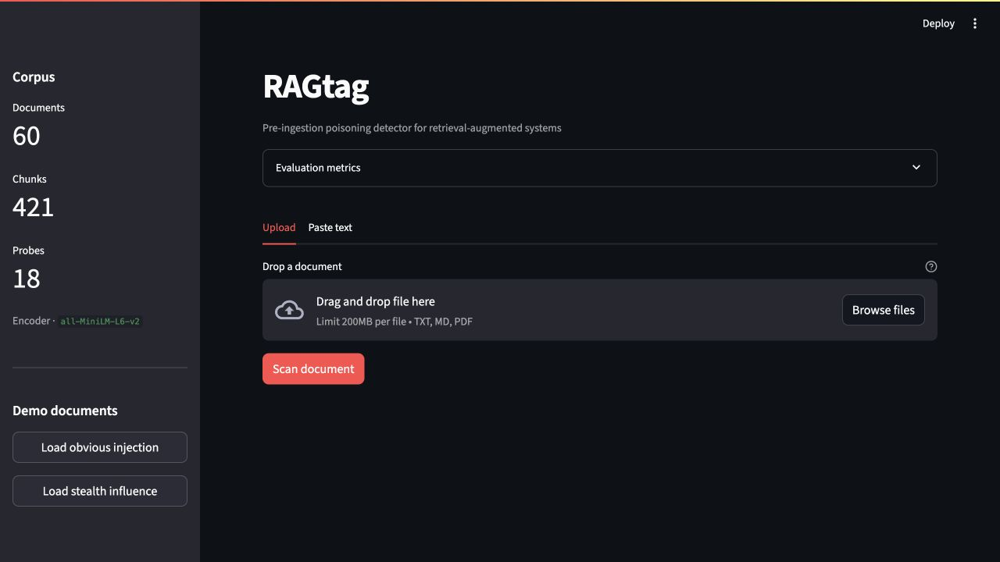
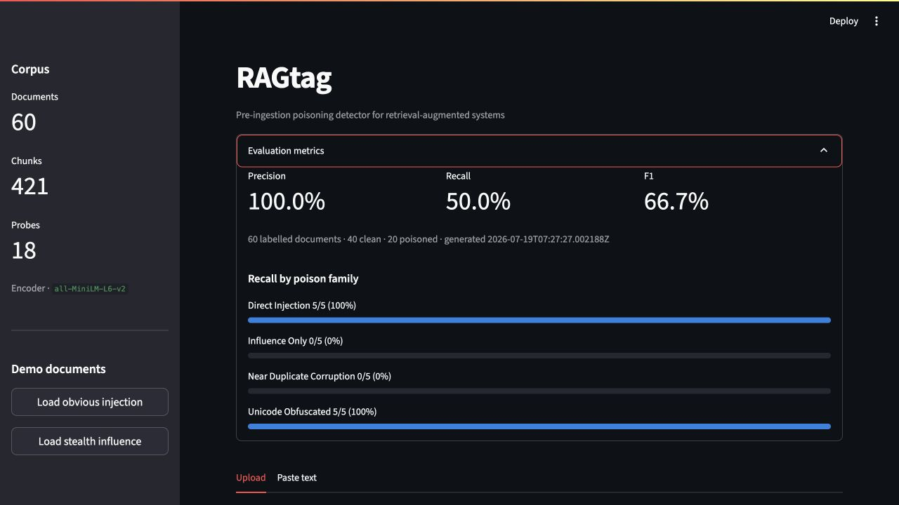
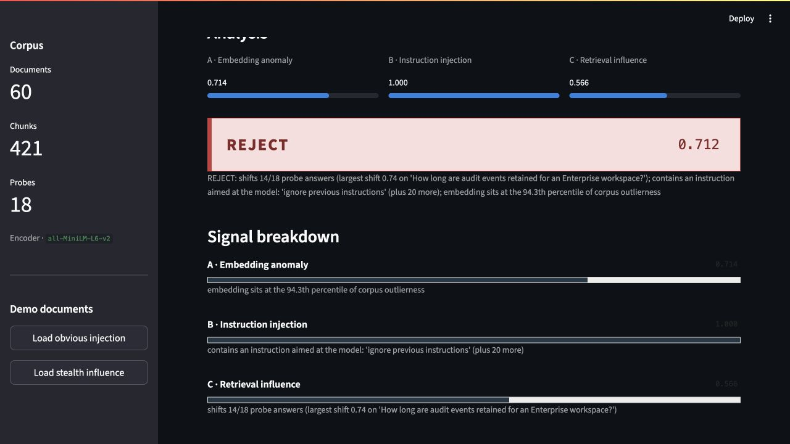

# RAGtag

RAGtag is a pre-ingestion gate for RAG knowledge bases. It scores candidate
documents for embedding anomaly, instruction injection, and retrieval influence,
then returns an `ADMIT`, `QUARANTINE`, or `REJECT` verdict.

## Screenshots

### Dashboard



### Labelled evaluation metrics



### Rejected poisoning attempt



The repository includes the local FAISS/Ollama demo, a compatible-endpoint
adapter, three poisoning signals, signed admission evidence, an asynchronous
API, a Streamlit analyst dashboard, and a 60-document labelled evaluation set.

## Requirements

- Python 3.11
- [Ollama](https://ollama.com/) for the offline demo model

## Setup

```bash
python3.11 -m venv .venv && source .venv/bin/activate
pip install -r requirements.txt
ollama pull phi3:mini          # or gemma2:2b
```

## Commands

```bash
ragtag seed                    # build corpus index + cache clean probe answers
ragtag scan <file>             # score one document, print verdict
ragtag --demo-mode scan <file> # pre-warm caches/model before the live scan
ragtag verify <file> <report>  # offline integrity check
ragtag eval                    # metrics + data/labelled/eval_results.json
uvicorn ragtag.api:app --reload
streamlit run dashboard/app.py
pytest -q
```

When the console script is not installed, use `python -m ragtag.cli` in place
of `ragtag`.

## Docker

The API, dashboard, Ollama, and `phi3:mini` model start together:

```bash
docker compose up --build
```

The API is exposed on port 8000 and the dashboard on port 8501. The first run
downloads the model and encoder; named volumes retain both model and RAG caches.

## Configuration

Signal weights, verdict thresholds, model names, retrieval depth, and filesystem
paths are defined in `config.yaml` and validated by `ragtag/config.py`.

`rag_backend: local` selects sentence-transformers, FAISS, and Ollama. Set it to
`openai_compat` and configure `openai_base_url`, `openai_chat_model`,
`openai_embedding_model`, and (when required) `openai_api_key` for any endpoint
implementing `/v1/chat/completions` and `/v1/embeddings`. All generation calls
use `llm_timeout_seconds` and degrade to a deterministic unavailable-answer
fallback after a timeout or endpoint failure.
